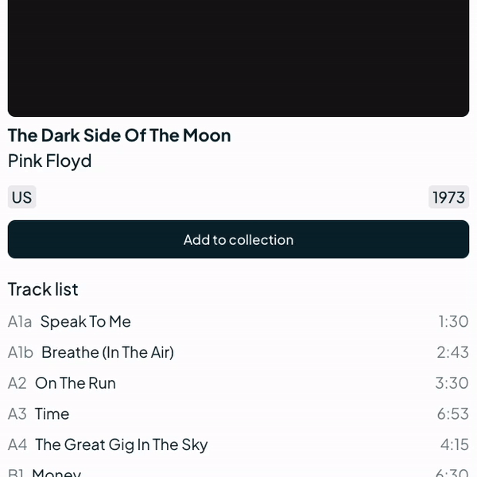
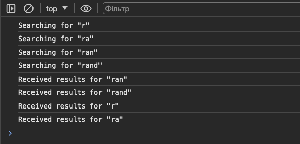

# Task description

Результат має бути доступний за посиланням [tasks/3.02-async-state/index.html](http://localhost:5173/tasks/3.02-async-state/index.html)

## Асинхронна зміна стану

Робота зі станом зазвичай не викликає труднощів, поки не доводиться додати в рівняння асинхронність. Так як більшість застосунків не можуть працювати без зовнішнього джерела даних - сервера, то асинхронність, як і комунікація з сервером, стає невідʼємною складовою будь якого застосунку.

1. **Додавання платівки в колекцію.** Цю функцональність імплементовано таким чином що після натискання на кнопку відправляється запит на сервер, щоб оновити інформацію про те чи знаходиться платівка в колекції.

    Але є проблема: якщо ми не дочекавшись відповіді сервера натиснемо кнопку ще декілька разів, то в результаті ми отримаємо дивне "моргання".

    

    Виправи код компоненту `Vinyl` щоб поведінка кнопки додавання в колекцію була такою:

    - Стан колекції на сервері вважаємо первинним, тому стан кнопки має відповідати фактичному стану колекції на сервері. Тобто якщо запит на додавання платівки в колекцію ще не відпрацював, то платівка ще не вважається доданою в колекцію і кнопка має бути в стані "Add to collection".
    - Якщо платівка не в колекції, то натискання на кнопку додає платівку в колекцію незалежно від кількості натискань.
    - Якщо платівка в колекції, то натискання на кнопку вилучає платівку з колекції незалежно від кількості натискань.
    - Якщо неперервно клікати на кнопку то її стан має змінюватись зі швидкістю відпрацювань запитів.

2. **Додавання платівки в список бажань** імплементовано із застосуванням патерну "оптимістичного UI". Це означає що ми моментально реагуємо на дію користувача зі зміною стану, а зміну стану на сервері робимо потім.

    Особливість такого підходу полягає в тому що якщо зміну стану на сервері з якихось причин не вдалось зробити, то локальний стан також має повернутись до попереднього синхронізованого стану.

    Щоб бути на 100% впевненими в тому що стан кнопки актуальний і відповідає стану на сервері ми рахуємо кількість запитів "в процесі" і реагуємо на "успіх"/"помилку" тільки після їх завершення.

    Але знову ж таки нас очікує несподівана поведінка: ми не повертаємось до попереднього стану, хоча запити на сервер закінчуються невдачею. Здається, що лічильник запитів працює якось неправильно.

    Виправ код компоненту `Vinyl` щоб поведінка кнопки додавання в бажання була такою:

    - Локальний стан кнопки вважаємо первинним, тому стан на сервері має відповідати локальному стану. Але якщо процес синхронізації виявився неуспішним, то локальний стан має повернутись до попереднього синхронізованого вигляду.
    - Натискання на кнопку "❤️" моментально змінює її стан на протилежний, не залежно від попереднього стану чи кількості активних запитів.
    - Після завершення всіх запитів стан кнопки має відповідати стану на сервері. А так як всі запити навмисно приречені на невдачу, то стан платівки має повернутись до "не в списку бажань".
    - Якщо неперервно клікати на кнопку то її стан має змінюватись на протилежний зі швидкістю кліків.

3. **Пошук платівок.** Запити пошуку відправляються в правильному порядку, але через затримку запитів в мережі повернутись вони можуть вже в іншому порядку, в наслідок чого користувач отримає зовсім не те що шукав.

    

    Виправ роботу зі станом в компоненті `NavigationBar`, щоб результати пошуку завжди відповідали введеному запиту.
